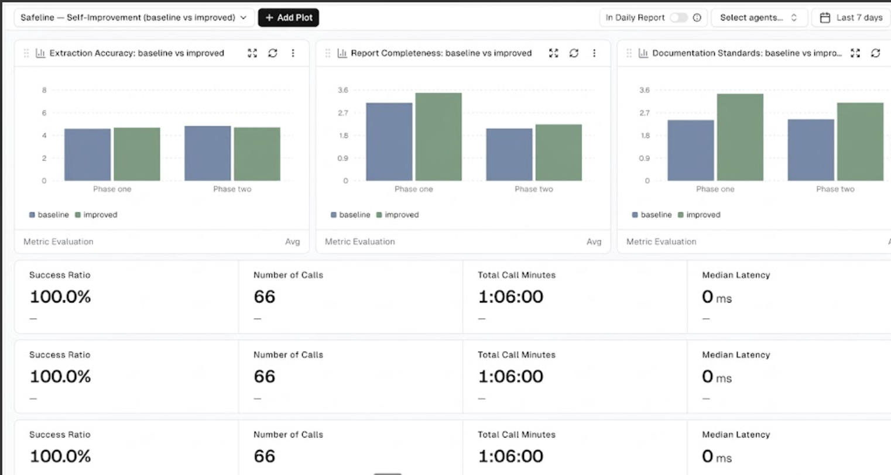

# Safeline — a police documentation voice agent that learns from its own corrections

> **Built from scratch at the YC Voice Agents Hackathon (Cekura × Daily, with NVIDIA, AWS, Twilio).** We started from the Pipecat starter kit for the voice plumbing and wrote everything else — the agent, its safety rules, and the entire learning loop — ground up in a single day.
>
> **Repo:** https://github.com/aryanmudgal-tech/safeline1

---

## 1. What is this?

Ask an officer what eats their shift, and the answer is paperwork. **56% of law enforcement professionals spend three or more hours of every shift writing incident reports instead of being out protecting the public.** That time comes at the end of a long day, the reports have to follow strict conventions (statutory charge codes, force-continuum terms, 24-hour times, Miranda wording), and a small slip can sink a case in court.

The tools meant to help fall short in two specific ways. They hallucinate — one well-known system summarized background cartoon audio into a report claiming an officer "shapeshifted into a frog." And they forget — Axon's Draft One deletes the AI draft the moment the officer exports it, so it keeps no record of what the officer fixed and never improves at the things officers fix over and over.

**Safeline is a voice agent an officer calls after an incident.** The officer just talks. Here's the full loop:

1. **Open narrative** — the officer says what happened, in their own words.
2. **Targeted follow-ups** — the agent asks one question at a time, only for required fields it didn't already hear.
3. **Report generation** — it extracts structured fields from the transcript and writes `null` for anything the officer never said. Inventing facts is forbidden.
4. **Six-digit handoff** — the agent speaks a code. The officer opens the review portal, types the code, and edits or approves the drafts.
5. **Learning** — every edit is saved as a labeled example. The next similar incident gets documented correctly the first time.

```
Call ─▶ open narrative ─▶ one-question gap filling ─▶ extract fields (null over invention)
                                                              │
                                          generate reports ─▶ speak 6-digit code
                                                              │
                                        officer edits & approves in the portal
                                                              │
                                      each edit becomes a stored correction
                                                              │
                  ┌───────────────────────────┼───────────────────────────┐
                  ▼                            ▼                           ▼
          Layer 1: fix the           Layer 2: prove it with       Layer 3: fine-tune the
          next report now            Cekura (no regressions)       open-weights model
```

Step 5 is the heart of the project. Section 3 takes it apart.

---

## 2. Demo video (under 60 seconds)

> **Video link:** https://drive.google.com/file/d/12grQ7uR837u36IkN1WaILOC0SHycm2rh/view?usp=sharing

The video is a pure product demo — a call coming in, the agent interviewing the officer, the spoken code, the portal. The *why*, the architecture, and the results all live in this README.

---

## 3. How we used Cekura, Nemotron, and Pipecat

These three tools serve one goal: **a voice agent that gets better the more it's used.** We call that the self-improvement loop, and it runs in three layers.

### The voice layer — Pipecat + NVIDIA Nemotron

The agent is a Pipecat pipeline, shipped in two interchangeable builds:

| Build | STT | LLM | TTS |
| --- | --- | --- | --- |
| `bot-gpt.py` | Gradium | OpenAI GPT-4.1 | Gradium |
| `bot-nemotron.py` | **Nemotron Speech Streaming** | **Nemotron-3-Super-120B** (vLLM) | Gradium |

Both run locally over WebRTC and over the phone through Twilio. The open-weights Nemotron build is what unlocks Layer 3: open weights mean we can train the model on our own correction data. A closed API model could never be the endpoint of this loop.

### What we use Cekura for

Cekura is how we **prove** the agent improves and keep it from backsliding. We wired it directly into the loop:

- **Corrections become permanent regression tests.** `cekura_sync.corrections_to_scenarios()` turns each officer edit into a scenario asserting "given a similar narrative, produce the corrected phrasing." Old mistakes can't quietly return.
- **Red-team scenarios guard against hallucination.** `red_team_scenarios()` ships the "frog" case and friends — noisy narratives where the right answer is `null`.
- **Baseline-vs-improved runs sit side by side** on a Cekura dashboard, so the lift is visible at a glance.
- **Tested at volume — not a one-off.** We drove **66 simulated calls (~66 minutes of voice, 100% completion)** through Cekura across the scenarios and red-team guards, repeated passes included. The suite, not a single happy-path demo.

Live in Cekura (org `Safeline`, project `5835`): agent `18073`, six metrics (`148024–148029`), six scenarios — three demo callers plus three red-team guards (`273197–273202`) — and the dashboard *"Safeline — Self-Improvement"* (`5692`).

### The loop, layer by layer

**Layer 1 — fix the next report immediately.** This is where the learning happens, and it works on the very next call.

- **Capture.** Each portal edit is stored as a correction: the transcript snippet, the original AI value, the officer's value, and the `(report_type, field)` it belongs to. It persists to `corrections_log.jsonl` across restarts.
- **Retrieve k similar incidents.** A new incident pulls the most similar past corrections. With `sentence-transformers` + `faiss` installed, it uses dense-vector search (all-MiniLM-L6-v2, cosine similarity); without them, it falls back to pure-Python token overlap so the agent runs anywhere.
- **Compile a rubric.** Dumping raw past corrections into the prompt is noisy and leaks one incident's values into another. So `guidance.py` groups corrections by field and compiles them into a short, deterministic rubric — `charges`: write it as `"VC 23152(a) - DUI"` rather than `"DUI"`; `force_type`: use `"Empty-hand control (takedown)"` rather than `"physical force"`. This is what a prompt optimizer like DSPy MIPROv2 converges toward, produced deterministically so the result is reproducible and cheap. Each line is a phrasing convention, never a fact to assert, so the agent learns the style without borrowing another case's data.
- **Inject and regenerate.** The rubric goes into the extraction prompt for the new report, so conventions officers keep fixing get applied automatically next time.

**Closing the loop without a human.** In production the signal comes from officers. For a reproducible demo we built an autonomous teacher (`teacher.py`): a stronger expert model writes the ideal report, and the diff against the agent's draft becomes corrections, exactly as an officer edit would. The teacher only *supplies* the signal — it never scores anything — so the before/after measurement stays honest.

**Layer 2 — prove it, and do no harm.** A change that helps on average can still hurt one case. Layer 2 catches that.

- **Six evaluators** score every report: completeness, extraction accuracy (anti-hallucination), narrative faithfulness, documentation standards, cross-document consistency, and question coverage — plus an escalation-correctness safety check. They run as LLM judges (`llm_judge.py`) with a deterministic heuristic fallback (`cekura_eval.py`), so the suite works offline with zero API spend.
- **A two-tier regression gate** (`regression_gate.py`) blocks any update that makes something worse. A metric that cliffs (drops past 0.15) blocks on its own; a small dip on a case that improved overall is flagged as a soft dip for review. The gate exits non-zero on a block, so it can gate CI or a deploy.

**Layer 3 — move the learning into the weights (the data flywheel).** Layers 1 and 2 live in the prompt. Layer 3 is the slow loop:

```
corrections_log.jsonl
   │  NeMo Curator     (dedupe, balance by report_type / field)
   ▼
training.jsonl  (transcript + field → corrected value)   ◀── finetune_export.py
   │  NeMo Customizer  (LoRA on Nemotron)
   ▼
candidate model
   │  NeMo Evaluator   (re-run the Cekura suite — beat base, no regressions)
   ▼
promote → retire the Layer-1 rubric for those patterns → shorter prompt, lower latency
```

Once a pattern lives in the weights, the agent drops its rubric line for it, so the prompt shrinks and calls get faster. We didn't run a live fine-tune in the hackathon, but the data export is real and runnable (`uv run python -m improvement.finetune_export`) and emits valid LoRA-ready JSONL.

### Results

We ran the full loop on three demo scenarios, twice each — once with learning OFF (a clean baseline) and once with learning ON — scored both passes with the LLM-judge evaluators, and let the teacher supply the corrections. Nothing was hand-tuned.



*66 simulated calls through Cekura, 100% completion. The table below isolates the headline baseline-vs-improved A/B — three scenarios, run twice each.*

From `data/experiments/20260530-151151` (LLM judges, 23 corrections learned in the run):

| Metric | Baseline | Improved | Δ |
| --- | ---: | ---: | ---: |
| Documentation Standards | 0.667 | 1.000 | **+0.333** |
| Question Coverage | 0.000 | 0.333 | **+0.333** |
| Report Completeness | 0.862 | 0.928 | **+0.066** |
| Extraction Accuracy | 0.955 | 0.963 | +0.008 |
| Narrative Faithfulness | 0.988 | 0.993 | +0.005 |
| Cross-Doc Consistency | 0.933 | 0.933 | +0.000 |
| **Overall** | **0.809** | **0.923** | **+0.114** |

Verdict: `PASS ✅ promote — 7 improved, 0 regressed, 1 soft-dip`. The biggest gains land exactly where we aimed: **documentation standards** and **question coverage**. Every other metric held or rose.

```bash
cd server
uv run python -m improvement.self_improve --demo       # baseline → teach → improved → delta → gate
uv run python -m improvement.self_improve --offline    # heuristic scoring, no API spend
```

---

## 4. What we built during the hackathon

**Borrowed and left untouched:** the Pipecat pipeline scaffold, the Twilio transport, and the Pipecat Cloud deploy config.

**Built from scratch, in the hackathon:**

- The two-phase police interview prompt, tools, emergency escalation, and six-digit code handoff (`police_agent.py`).
- Field extraction and the permanent store that keeps the immutable AI draft *and* the officer-edited version (`report_generator.py`), plus the report templates.
- The review portal — a FastAPI app and SPA where the officer enters the code, edits, and approves (`review_ui/`).
- **The entire self-improvement loop** (`improvement/`): the correction store with dense-or-fallback retrieval, the deterministic guidance compiler, the autonomous teacher, the six evaluators, the two-tier regression gate, the Cekura sync, the fine-tune export, and the `self_improve` harness that ties them together.
- The NVIDIA Nemotron build of the bot (`bot-nemotron.py`, `nemotron_llm.py`, `nvidia_stt.py`).

The voice plumbing is borrowed. The agent, its safety behavior, and the learning loop are all ours, written this day.

---

## 5. Feedback on the tools

### NVIDIA — Nemotron

**Strong:**
- **Instruction-following held up.** Our extraction prompt demands strict JSON with exact field names and `null` for anything unstated, and Nemotron-3-Super-120B stuck to it. That discipline is precisely what an anti-hallucination task needs.
- **The per-request reasoning toggle is a great lever** — we traded latency for quality on the harder multi-report incidents without swapping models.
- **Open weights make Layer 3 possible.** Our whole flywheel only exists because we can fine-tune the model on officer corrections.

**Could improve:**
- **First-token latency on the 120B is high for live phone calls.** Voice agents win or lose on turn-taking; a smaller Nemotron (Nano-class) or faster default decoding would help. A published latency/quality table per model size would speed model selection.
- **Self-hosting the STT + LLM was the fiddliest part of the day** — endpoint URLs, the reasoning-parser flag, and the `/v1/models` name all had to line up. A single "voice agent quickstart" container bundling ASR + LLM with sane defaults would save hours.

### Cekura — building a self-improvement loop

**Strong:**
- The MCP server + Claude Code skills let us create agents, metrics, scenarios, and runs without leaving the terminal — a real speed-up for a one-day build.
- Modeling **corrections as regression scenarios** mapped perfectly onto Cekura's scenario primitive. Turning real edits into permanent tests felt exactly right.
- The baseline-vs-improved dashboard sells the lift to a judge in one glance.

**Friction (and a bug):**
- We wanted a **first-class "compare two runs" regression gate** in the platform. We built our own (`regression_gate.py`); the hosted comparison (`check_via_cekura` / `fetch_run_scores`) is still a stub because there was no clean single call to pull two runs' per-scenario, per-metric scores and diff them. A native "promote run B over A only if no metric regressed" check would be the killer feature here.
- **Bug / gap:** pushing a batch of already-scored *offline* results as call logs for charting wasn't obvious. We serialize a `cekura_payload.json` and drive the upload through MCP, but a documented bulk-ingest endpoint for "I scored these myself, just chart them" would help.
- Feeding **corrections back as metric feedback to tune the judges** would close the loop even tighter — the judge could learn the same conventions the agent does. We have the data shaped for it but found no hook.

### Daily — Pipecat / Pipecat Cloud

- A great launch pad. Local WebRTC iteration before touching the phone kept the dev loop fast, and swapping STT/LLM/TTS services was clean enough to maintain two bot builds in parallel.
- First launch silently downloads VAD / turn-detection models (~20s). A one-line "this is normal" console note would calm nerves during a timed build.

### Twilio

- Wiring a number to the bot through a TwiML Bin was smooth once set up.
- **The snag:** getting one agent to serve **multiple inbound numbers** took trial and error in the number config. We solved it, but clearer docs on the many-numbers-to-one-agent case would have saved time.

---

## Takeaway

Voice will be the default interface for high-stress, hands-busy jobs like policing, where typing a report is the worst possible tool. The agents that matter will be the ones that improve the more they're used.

Safeline is that argument, with the receipts. Every officer correction becomes labeled data, the next similar report comes out right, Cekura confirms nothing regressed, and over time the open-weights model folds the lessons into its weights. We measured the flywheel turning once: **+0.114 overall, +0.333 on the conventions officers care about most, zero regressions.**

---

## Appendix — run it locally

```bash
cd server
cp .env.example .env          # fill in OPENAI_API_KEY and GRADIUM_API_KEY
uv sync                       # add `--extra improve` for faiss + MiniLM dense retrieval (optional)

# Terminal 1 — voice bot (WebRTC at http://localhost:7860)
uv run bot-gpt.py             # or: uv run bot-nemotron.py

# Terminal 2 — review portal (http://localhost:8080)
uv run python review_ui/api.py
```

Open http://localhost:7860, click **Connect**, give a badge number (e.g. `3892`), and read one of the narratives in `mock_data/demo_scenarios.json`. The agent generates the reports and speaks a six-digit code; open the portal, enter it, and review.

**Review portal API:**

```http
GET  /api/reports/{6-digit-code}            # generating → pending_review, with editable reports
POST /api/reports/{6-digit-code}/approve    # body: { "edited_reports": { ... } } — stores the officer version, feeds the loop
GET  /api/reports/{incident_id}/diff        # officer-vs-AI corrections, for Cekura to consume
```

| File / dir | Role |
| --- | --- |
| `police_agent.py` | Two-phase interview, tools, escalation, six-digit handoff. |
| `report_generator.py` | Field extraction + permanent store (AI draft + officer version + diff). |
| `improvement/correction_store.py` | Layer 1: correction store (faiss/MiniLM, token-overlap fallback). |
| `improvement/guidance.py` | Layer 1: compiles corrections into the field rubric. |
| `improvement/teacher.py` | Autonomous corrections — the loop runs without a human. |
| `improvement/llm_judge.py`, `cekura_eval.py` | Layer 2: six evaluators (LLM judge + heuristic fallback). |
| `improvement/regression_gate.py` | Layer 2: two-tier promotion gate. |
| `improvement/cekura_sync.py` | Layer 2: corrections→scenarios, red-team, dashboard. |
| `improvement/finetune_export.py` | Layer 3: corrections → LoRA-ready JSONL. |
| `improvement/self_improve.py` | The harness: baseline → teach → improved → delta → gate. |
| `review_ui/` | FastAPI + SPA review portal. |

<!-- last-updated: 2026-07-27 -->
